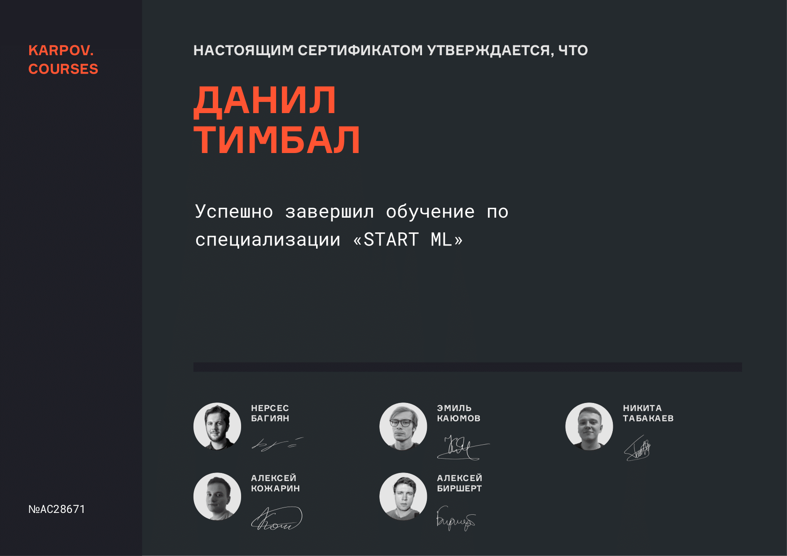

<h1 align="center">Привет 👋, меня зовут Данил</h1>
<h3 align="center">Я ML-инженер</h3>

- ⚡ Работа в сфере администрирования и управления познакомила меня с людьми, который открыли мне мир Data Science.

- 🌱 Продолжаю развиваться и получать опыт решения ML-задач на курсе **Симулятор ML-инженера от karpov.courses**

- 👨‍💻 Люблю изучать новые технологии и быть на стыке инноваций.

- 📫 Для сотрудничества пишите в Telegram: @daniltimbal 

<h3 align="left">Стек технологий:</h3>

  
  
  
  
  
  
  

<h3 align="left">Обучение:</h3>

Ссылка на сертификат: https://lab.karpov.courses/certificate/2aef00aa-aef1-49c5-9140-fcae80ed58b3/
